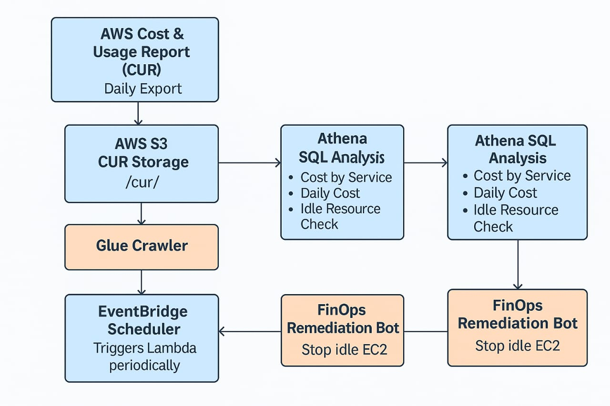

# 🚀 AWS Hyper-Efficient FinOps  
### Automated Cloud Waste Remediation Engine  
Cost Analysis • Idle Resource Detection • Serverless Automation  

This project implements a complete **FinOps Automation Pipeline** using AWS native services.  
It collects AWS Cost & Usage Report (CUR), transforms it using Glue, analyzes it using Athena, and triggers automated remediation using Lambda + EventBridge.

The goal is to **detect idle cloud resources** and **reduce cost waste automatically**.

---

# 🌟 Project Overview

### ✔ Automated CUR Delivery to S3  
### ✔ Glue Crawler → Creates Athena Table  
### ✔ Athena → Cost & Usage Analysis  
### ✔ Idle EC2 Instance Detection  
### ✔ Lambda → Automated Remediation Logic  
### ✔ EventBridge → Scheduled Execution  
### ✔ IAM → Secure Access (no root user)

This architecture is fully **serverless**, scalable, cost-efficient, and requires **zero manual maintenance**.

# 🏗 Architecture

<p align="center">
  
</p>

# 📂 Repository Structure
aws-finops-automation-engine/
│
├── lambda/
│ └── fremediation_bot.py
│
├── sql/
│ ├── cost_by_service.sql
│ ├── daily_cost_trend.sql
│ └── idle_ec2_detection.sql
│
├── architecture/
│ └── architecture.jpg
│
├── screenshots/
│ └── (AWS screenshots)
│
└── report/
└── AWS-Hyper-Efficient-FinOps.pdf

# 🔧 AWS Services Used & Why

| Service | Why We Used It |
|--------|----------------|
| **S3** | Stores CUR files in Parquet format. |
| **CUR** | Provides detailed cost & usage data. |
| **Glue Crawler** | Auto-detects schema & builds Athena table. |
| **Glue Data Catalog** | Metadata layer for analytics. |
| **Athena** | Serverless SQL to analyze CUR data. |
| **Lambda** | Runs automated remediation bot. |
| **EventBridge** | Schedules Lambda every 6 hours. |
| **IAM** | Secure identity instead of root account. |

# 🧠 Key Athena Queries

### 🔹 1. Cost by AWS Service
```sql
SELECT product_servicecode,
       SUM(line_item_unblended_cost) AS cost
FROM finops_cur_db.cur_data
GROUP BY product_servicecode
ORDER BY cost DESC;

🔹 2. Daily Cost Trend
SELECT DATE(line_item_usage_start_date),
       SUM(line_item_unblended_cost)
FROM finops_cur_db.cur_data
GROUP BY 1
ORDER BY 1;

🔹 3. Idle EC2 Detection
SELECT line_item_resource_id,
       SUM(line_item_usage_amount) AS hours
FROM finops_cur_db.cur_data
WHERE product_servicecode='AmazonEC2'
  AND line_item_usage_type LIKE '%BoxUsage%'
GROUP BY line_item_resource_id
ORDER BY hours ASC;

🤖 Lambda Remediation Bot

lambda/remediation_bot.py:

import boto3

def lambda_handler(event, context):
    print("FinOps Remediation Bot Executed")
    return {"status": "Success"}


Future enhancement: auto-stop idle EC2, send alerts, integrate SNS.

⏱ EventBridge Scheduler
Runs every 6 hours
Triggers the Lambda function
Enables continuous automated FinOps monitoring

📘 Detailed Report
Full project report available at:
report/AWS-Hyper-Efficient-FinOps.pdf

🚀 Future Enhancements
QuickSight dashboards (when region supports it)
Auto-stop or hibernate idle EC2
Team-wise cost allocation via tags
SNS notifications
Real-time EC2 monitoring system